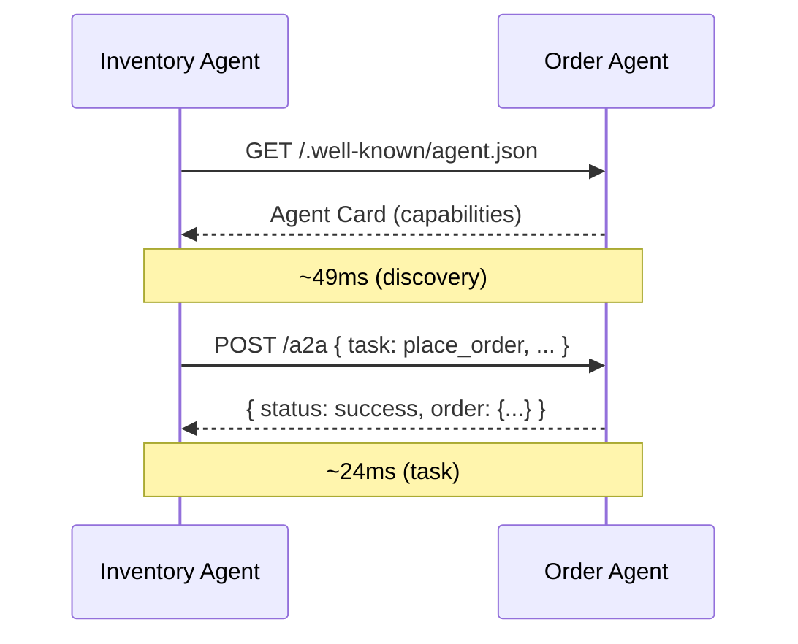

# v0.4 — Raw A2A: Two Agents Talking to Each Other

Introduce Agent-to-Agent (A2A) communication. The Inventory Agent detects low stock and autonomously pings the Order Agent to place a restock order — no human in the loop.

---

## What Is A2A?

**A2A (Agent-to-Agent)** is an open protocol by Google that lets AI agents discover and communicate with each other in a standardized way.

Instead of hardcoding "call this URL with this payload", A2A adds a **discovery layer**:

1. Every agent publishes an **Agent Card** at `/.well-known/agent.json`
2. Other agents fetch this card to learn what the agent can do
3. Then they send structured **task requests**

---

## What This Project Does

Two agents run independently and communicate autonomously:

1. **Inventory Agent**: Reads `inventory_db`, finds low stock, fetches Order Agent's card, and sends restock requests.
2. **Order Agent**: Serves Agent Card, receives A2A requests, and creates orders in `orders_db`.

### Architecture


### A2A Communication Flow



---

## Benchmarking A2A vs Direct API

| Step | Latency |
|---|---|
| Agent Card discovery | ~49ms (one-time) |
| A2A task call | ~24ms |
| Direct API call | ~23.7ms |
| **Per-call A2A overhead** | **0.3ms** |

**The A2A overhead per call is essentially zero (0.3ms).** The only real cost is the one-time discovery step. Caching the Agent Card makes subsequent calls as fast as direct API calls.

---

## Visual Proof

````carousel

<!-- slide -->

````

---

## Tech Stack

- **FastAPI / uvicorn**: Order Agent HTTP server
- **httpx**: Async HTTP client for A2A communication
- **PostgreSQL 16**: Dual database setup (`inventory_db`, `orders_db`)
- **Python 3.13**: Runtime
